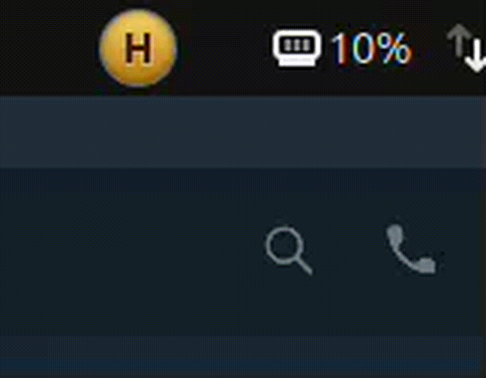

# Coinflip GNOME Shell Extension

Simple GNOME Shell extension for a coin flip widget.

Supports GNOME Shell 49 and 50.

Install locally:

1. Clone or copy this folder to `~/.local/share/gnome-shell/extensions/coinflip@limkaiwei.github.io`
2. Log out and back in so GNOME Shell loads the extension and its current compatibility metadata.
3. Enable the extension with `gnome-extensions enable coinflip@limkaiwei.github.io` or the Extensions app.

Files:

- `extension.js` — main extension code
- `metadata.json` — extension metadata
- `stylesheet.css` — styling

## Demo

